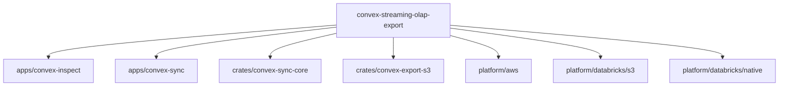
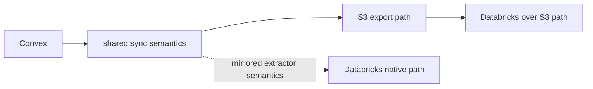

# convex-streaming-olap-export

- `Language`: 
- `Source`: 
- `Targets`:  
- `Infra`: 

Convex CDC sync engine with two supported target families:

- `S3/export`: append-only raw parquet -> current-state staging parquet -> S3 publish
- `Databricks/native`: bronze Delta CDC landing -> Lakeflow `AUTO CDC` -> silver current-state Delta tables

The source-side behavior intentionally stays close to the public Convex/Fivetran
extraction model:

- bootstrap with `list_snapshot`
- resume incomplete snapshots from checkpoint
- continue with `document_deltas`
- advance checkpoints only after durable writes succeed

## Repo Map



Read the repo by layer:

- [`apps/convex-inspect/README.md`](apps/convex-inspect/README.md): direct source inspection commands
- [`apps/convex-sync/README.md`](apps/convex-sync/README.md): CLI surface and S3/export runtime commands
- `crates/convex-sync-core/`: shared Convex client, checkpoint FSM, event normalization, sync engine
- `crates/convex-export-s3/`: raw parquet sink, staging materialization, S3 publish flow
- [`platform/aws/README.md`](platform/aws/README.md): AWS assets for publishing and downstream readers
- [`platform/databricks/README.md`](platform/databricks/README.md): Databricks target family overview
- [`platform/databricks/s3/README.md`](platform/databricks/s3/README.md): Databricks consuming the S3 export path
- [`platform/databricks/native/README.md`](platform/databricks/native/README.md): Databricks-native bronze/silver landing

## Install

Release install:

```bash
curl -fsSL https://raw.githubusercontent.com/shpitdev/convex-streaming-olap-export/main/install.sh | bash
```

Local checkout dev install:

```bash
./install.sh --mode dev --force
convex-sync-dev --help
```

Current release coverage:

- stable and prerelease archives target `linux-amd64`
- `convex-sync-dev` is checkout-linked and rebuilds incrementally via Cargo
- release installs go to `~/.local/share/convex-sync/<version>/convex-sync`
- command symlinks go in `~/.local/bin`
- `convex-inspect` is repo-local today and not part of the release artifact

## Operator Binaries

- `convex-inspect`: inspect Convex schemas, snapshot pages, and delta pages directly
- `convex-sync`: run the maintained parquet -> staging -> S3 export workflow

## Supported Variations



### `S3/export`

The maintained Rust runtime path:

1. `sync-once` writes append-only parquet batches under `.memory/raw_change_log/`
2. `materialize-staging --incremental` builds `.memory/staging/`
3. `publish-s3` uploads `staging/current/...` plus versioned manifests
4. `run` loops those steps on a poll interval

CLI:

- `cargo run -p convex-sync -- sync-once`
- `cargo run -p convex-sync -- materialize-staging`
- `cargo run -p convex-sync -- publish-s3 --bucket your-bucket`
- `cargo run -p convex-sync -- run --bucket your-bucket`

Inspection:

- `cargo run -p convex-inspect -- schemas`
- `cargo run -p convex-inspect -- snapshot --table-name users`
- `cargo run -p convex-inspect -- deltas --cursor 0`

Or via `just`:

- `just dev-cli --help`
- `just schemas`
- `just snapshot --table-name users`
- `just deltas --cursor 0`
- `just sync-once`
- `just materialize-staging`
- `just publish-s3 --bucket your-bucket`
- `just run --bucket your-bucket`

### `Databricks/native`

Checked-in Databricks-native assets:

- `platform/databricks/native/extractor/convex_cdc_job.py`
- `platform/databricks/native/sql/bootstrap/`
- `platform/databricks/native/lakeflow/bronze_to_silver_template.sql`

Runtime split:

1. a Databricks job runs the extractor and appends bronze CDC rows
2. checkpoint rows land in the control schema
3. Lakeflow `AUTO CDC` materializes silver current-state tables

### `Databricks over S3`

This variation keeps the existing Rust exporter and S3 publish loop, then adds:

1. Unity Catalog external location coverage over `staging/current`
2. stable SQL views from `platform/databricks/s3/sql/register_staging_views.sql.tmpl`
3. Databricks consumers reading the published parquet snapshots directly

## Platform Assets

Snapshot templates into `.memory/` before running Terraform:

- `just aws-template-snapshot`
- `just databricks-template-snapshot`

The S3-backed Databricks landing sync remains supported:

- `just databricks-sync-staging-views --warehouse-id <warehouse-id> --bucket <bucket> --prefix <prefix>`

That script renders SQL from
`platform/databricks/s3/sql/register_staging_views.sql.tmpl` and applies stable
views over the published S3 parquet files.

## Verification

Local:

- `just install-hooks` configures a repo-local pre-commit hook
- the hook runs `just verify`

Remote:

- `.depot/workflows/ci.yml` runs:
  - `02-rustfmt`
  - `01-changed-paths`
  - `03-clippy-inspect`
  - `04-test-inspect`
  - `05-clippy-sync`
  - `06-test-sync`
- `.depot/workflows/release.yml` creates stable release PRs and publishes CLI archives
- `.depot/workflows/release-rc.yml` publishes numbered prerelease archives from `main`
- `.github/workflows/semantic-pr.yml` enforces conventional PR titles so stable releases can be created automatically from merged PRs
- `.github/workflows/semgrep.yml` runs the lightweight security scan

## Release Source Of Truth

Stable releases are driven by merged PR titles on `main`.

- use conventional PR titles such as `feat: ...`, `fix: ...`, or `deps: ...`
- `release-please` now starts release history from commit `0cf9f47`
- merge to `main` opens or advances the stable release PR automatically when a releasable PR lands
- both release workflows also support manual `workflow_dispatch`, so there is always a button path in GitHub Actions

## References

- [docs/architecture.md](docs/architecture.md)
- [docs/public-reference-map.md](docs/public-reference-map.md)
- [docs/release-artifacts.md](docs/release-artifacts.md)
- [Convex streaming export docs](https://docs.convex.dev/production/integrations/streaming-import-export)
- [Convex streaming export API](https://docs.convex.dev/streaming-export-api)
- [Upstream Convex `fivetran_source` crate](https://github.com/get-convex/convex-backend/tree/main/crates/fivetran_source)
- [Databricks `AUTO CDC` docs](https://docs.databricks.com/aws/en/ldp/cdc)
