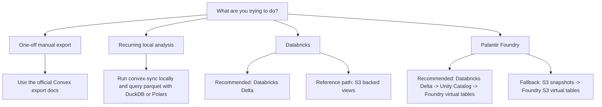

# convex-sync-kit

Recurring Convex export pipelines for local analytics, Databricks, and downstream systems like Palantir Foundry.

[](https://deepwiki.com/shpitdev/convex-sync-kit)
[](https://github.com/shpitdev/convex-sync-kit/releases)
[](LICENSE)


## Required Inputs

These are the minimum inputs almost everyone needs before a recurring sync will work:

```bash
export CONVEX_DEPLOYMENT_URL=https://your-deployment.convex.cloud
export CONVEX_DEPLOY_KEY=your-convex-deploy-key
```

Target-specific requirements:

| Target | Also required |
|---|---|
| Local recurring analysis | writable output paths |
| S3/export | AWS credentials, `--bucket`, optional `--prefix` |
| Databricks Delta | Databricks profile plus a SQL warehouse ID for bootstrap |
| Databricks over S3 | Databricks profile, SQL warehouse ID, and Unity Catalog external-location coverage |
| Palantir Foundry | either Databricks/Unity Catalog or an S3 path to connect Foundry to |

## Choose Your Path



### 1. One-off manual export

If you only need a one-time export or ad hoc backfill, use the official Convex tooling directly. This repo is aimed at recurring pipelines, not the simplest possible one-shot export.

See:

- [Convex streaming import/export](https://docs.convex.dev/production/integrations/streaming-import-export)
- [Convex streaming export API](https://docs.convex.dev/streaming-export-api)

### 2. Recurring local analysis

If you want recurring exports but do not want a warehouse yet, run the S3/export engine locally and point the outputs wherever you want. `.memory/` is only this repo's default. Every path-bearing command can be overridden.

```bash
mkdir -p /tmp/convex-sync-kit-demo

convex-sync sync-once \
  --output /tmp/convex-sync-kit-demo/raw_change_log \
  --checkpoint-path /tmp/convex-sync-kit-demo/raw_change_log.checkpoint.json

convex-sync materialize-staging \
  --raw-change-log /tmp/convex-sync-kit-demo/raw_change_log \
  --output /tmp/convex-sync-kit-demo/staging \
  --incremental

duckdb -c "select * from read_parquet('/tmp/convex-sync-kit-demo/staging/**/*.parquet') limit 20"
```

### 3. Using Databricks

There are two supported Databricks paths:

| Path | What it creates | When to use it | Recommendation |
|---|---|---|---|
| Databricks Delta | Unity Catalog control, bronze, and silver schemas | Primary production path | Recommended |
| Databricks over S3 | Unity Catalog views over published Parquet snapshots | Reference example, simpler bridge from the Rust exporter | Supported, but secondary |

Recommended Databricks Delta flow:

```bash
export CONVEX_SYNC_SOURCE=<source-slug>

just databricks-delta-bootstrap <warehouse-id>
just databricks-delta-sync-secret DEFAULT
just databricks-delta-deploy DEFAULT prod
just databricks-delta-run DEFAULT prod
```

The Delta path creates and updates:

- `convex_sync_kit_<source>_delta_control`
- `convex_sync_kit_<source>_delta_bronze`
- `convex_sync_kit_<source>_delta_silver`

The silver schema is expected to stay empty until you stand up a Lakeflow `AUTO CDC` pipeline for the tables you actually want to materialize there.

Reference Databricks over S3 flow:

```bash
export CONVEX_SYNC_SOURCE=<source-slug>

just run --bucket <bucket> --prefix prod
just databricks-sync-staging-views --warehouse-id <warehouse-id> --bucket <bucket> --prefix prod
```

### 4. Using Palantir Foundry

If you are already on Databricks, the recommended Foundry path is:

```text
Convex -> convex-sync-kit Databricks Delta -> Unity Catalog -> Foundry Databricks source -> virtual tables
```

That path is the best fit because Foundry's Databricks connector supports virtual tables over Unity Catalog, including richer Delta and Iceberg behavior when external access is enabled.

Fallback path:

```text
Convex -> convex-sync-kit S3 snapshots -> Foundry S3 source -> Parquet virtual tables or dataset sync
```

That works, but it is a simpler and more limited path. Palantir's S3 connector supports Parquet virtual tables, but they rely on schema inference, while the Databricks connector gives you a cleaner Unity Catalog table surface.

Relevant Foundry docs:

- [Databricks connector](https://www.palantir.com/docs/foundry/available-connectors/databricks/)
- [Amazon S3 connector](https://www.palantir.com/docs/foundry/available-connectors/amazon-s3/)
- [Virtual tables](https://www.palantir.com/docs/foundry/data-integration/virtual-tables/index.html)

## What This Repo Produces

| Path | Core artifacts | Current recommended naming |
|---|---|---|
| Local recurring analysis | raw change log parquet, staging parquet | user-defined paths |
| S3/export | `staging/current`, manifests, versioned snapshots | bucket and prefix chosen by operator |
| Databricks over S3 | Unity Catalog views over published parquet snapshots | `convex_sync_kit_<source>_s3` |
| Databricks Delta | checkpoint table, bronze CDC tables, silver current-state tables | `convex_sync_kit_<source>_delta_{control,bronze,silver}` |

The checked-in [`sources/meshix-api/env.sh`](sources/meshix-api/env.sh) file is only an example source profile, not a repo identity. Add more source directories as you onboard more Convex projects.

## Output Paths And Defaults

Examples in this repo often use `.memory/` because that is convenient for local development here. It is not a required location.

| Command | Default | How to override |
|---|---|---|
| `convex-sync sync-once` | `.memory/raw_change_log` | `--output`, `--checkpoint-path` |
| `convex-sync materialize-staging` | `.memory/staging` | `--raw-change-log`, `--output`, `--state-path` |
| `convex-sync publish-s3` | `.memory/staging` | `--staging-dir`, `--bucket`, `--prefix` |
| `convex-sync run` | `.memory/raw_change_log`, `.memory/staging` | `--output`, `--checkpoint-path`, `--staging-dir`, `--staging-state-path`, `--bucket`, `--prefix` |
| `convex-inspect` commands | stdout unless set | `--output`, `--output-format` |

## Docs By Audience

| Audience | Start here | Why |
|---|---|---|
| End users / operators | [`platform/databricks/delta/README.md`](platform/databricks/delta/README.md), [`platform/databricks/s3/README.md`](platform/databricks/s3/README.md), [`sources/README.md`](sources/README.md) | Platform-specific deployment and source defaults |
| CLI users | [`apps/convex-sync/README.md`](apps/convex-sync/README.md), [`apps/convex-inspect/README.md`](apps/convex-inspect/README.md) | Command reference and CLI help |
| Contributors | [`platform/databricks/README.md`](platform/databricks/README.md), [`platform/aws/README.md`](platform/aws/README.md), [docs/architecture.md](docs/architecture.md) | Code ownership and platform layout |

## Testing And CI

| Layer | Present | Tooling | Runs in CI |
|---|---|---|---|
| unit | yes | `cargo test --workspace` | yes |
| integration | no | `none` | no |
| e2e api | no | `none` | no |
| e2e web | no | `none` | no |

Remote automation:

```bash
depot ci run --workflow .depot/workflows/ci.yml
```

Release automation:

```bash
depot ci run --workflow .depot/workflows/release.yml
depot ci run --workflow .depot/workflows/release-rc.yml
```

## Suggested Screenshots

If you want to show this repo working in a talk or video, start with:

1. The decision tree above, so viewers understand when this repo is the right tool.
2. Databricks Jobs showing `convex-sync-kit-meshix-api-prod-delta-extract` succeeding.
3. Unity Catalog showing both:
   - `convex_sync_kit_meshix_api_s3`
   - `convex_sync_kit_meshix_api_delta_control`
   - `convex_sync_kit_meshix_api_delta_bronze`
   - `convex_sync_kit_meshix_api_delta_silver`
4. A query result from `connector_checkpoint_latest` showing `meshix-api / delta_tail`.
5. A `SHOW TABLES` result for the bronze schema showing many `_cdc` tables.
6. The S3-backed `__source_map` view so people can see the reference path is real too.

There is a more detailed capture list in [docs/demo-storyboard.md](docs/demo-storyboard.md).

## References

- [Ask DeepWiki about this repo](https://deepwiki.com/shpitdev/convex-sync-kit)
- [docs/architecture.md](docs/architecture.md)
- [docs/public-reference-map.md](docs/public-reference-map.md)
- [docs/release-artifacts.md](docs/release-artifacts.md)
- [docs/demo-storyboard.md](docs/demo-storyboard.md)
- [Upstream Convex `fivetran_source` crate](https://github.com/get-convex/convex-backend/tree/main/crates/fivetran_source)
- [Databricks `AUTO CDC` docs](https://docs.databricks.com/aws/en/ldp/cdc)

## License

[Apache License 2.0](LICENSE)
