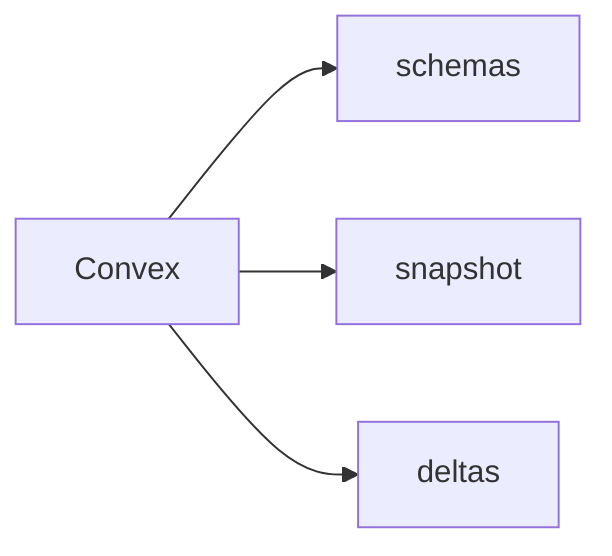

# `convex-inspect` CLI

This is the repo-local source inspection CLI.



## Help

```bash
cargo run -p convex-inspect -- --help
cargo run -p convex-inspect -- schemas --help
cargo run -p convex-inspect -- snapshot --help
cargo run -p convex-inspect -- deltas --help
```

## Example Commands

```bash
cargo run -p convex-inspect -- schemas --delta-schema --output /tmp/convex-sync-kit/schemas.json

cargo run -p convex-inspect -- snapshot \
  --table-name users \
  --all-pages \
  --output /tmp/convex-sync-kit/users-snapshot.jsonl \
  --output-format jsonl

cargo run -p convex-inspect -- deltas \
  --cursor 0 \
  --max-pages 5 \
  --output /tmp/convex-sync-kit/deltas.json \
  --output-format json
```

`convex-inspect` is intentionally repo-local for now. The released operator-facing binary remains `convex-sync`.
