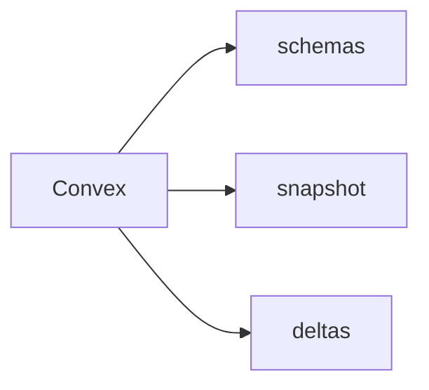

# `convex-inspect` CLI

Direct source-inspection CLI for Convex snapshot and delta APIs.



## Commands

- `schemas`: fetch Convex schema metadata
- `snapshot`: inspect snapshot pages directly
- `deltas`: inspect delta pages directly

## Help

```bash
cargo run -p convex-inspect -- --help
cargo run -p convex-inspect -- snapshot --help
```

This binary is intentionally repo-local for now. The released operator-facing
artifact remains `convex-sync`.
