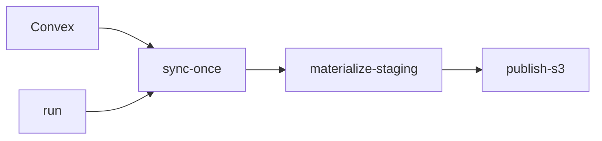

# `convex-sync` CLI

Operational CLI for the maintained Rust runtime path.



## Commands

- `schemas`: fetch Convex schema metadata
- `snapshot`: inspect snapshot pages directly
- `deltas`: inspect delta pages directly
- `sync-once`: write append-only raw change-log parquet
- `materialize-staging`: collapse raw changes into latest-state staging parquet
- `publish-s3`: publish staging parquet to S3
- `run`: poll Convex and drive the full S3/export loop

## Help

```bash
cargo run -p convex-sync -- --help
cargo run -p convex-sync -- sync-once --help
```

Checkout-linked dev install:

```bash
./install.sh --mode dev --force
convex-sync-dev --help
```
