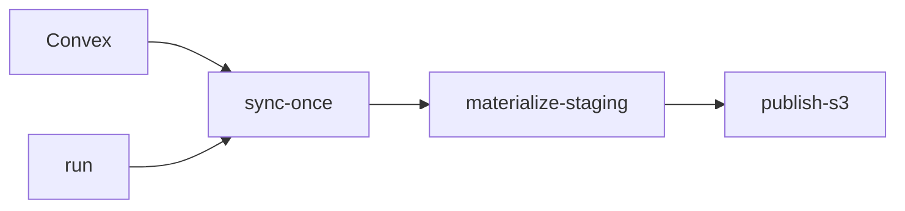

# `convex-sync` CLI

This is the operator-facing CLI for the maintained recurring export path.



## Help

```bash
cargo run -p convex-sync -- --help
cargo run -p convex-sync -- sync-once --help
cargo run -p convex-sync -- materialize-staging --help
cargo run -p convex-sync -- publish-s3 --help
cargo run -p convex-sync -- run --help
```

## Local Example

`.memory/` is only the repo default. Override the paths if you want the output elsewhere.

```bash
mkdir -p /tmp/convex-sync-kit-demo

cargo run -p convex-sync -- sync-once \
  --output /tmp/convex-sync-kit-demo/raw_change_log \
  --checkpoint-path /tmp/convex-sync-kit-demo/raw_change_log.checkpoint.json

cargo run -p convex-sync -- materialize-staging \
  --raw-change-log /tmp/convex-sync-kit-demo/raw_change_log \
  --output /tmp/convex-sync-kit-demo/staging \
  --incremental

cargo run -p convex-sync -- publish-s3 \
  --staging-dir /tmp/convex-sync-kit-demo/staging \
  --bucket your-bucket \
  --prefix prod
```

## Dev Install

```bash
./install.sh --mode dev --force
convex-sync-dev --help
```

Direct source inspection lives in [`apps/convex-inspect/README.md`](../convex-inspect/README.md).
