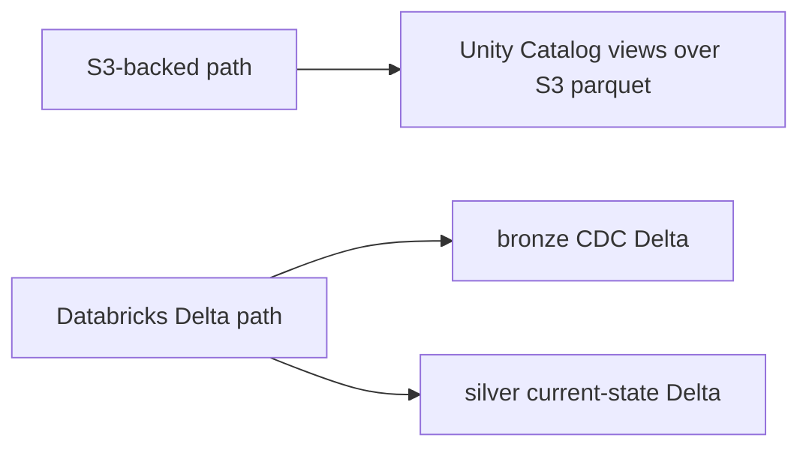

# Databricks Platform Assets

Databricks assets grouped by target family:

- `s3/`: Databricks consuming the existing S3 export path
- `delta/`: Databricks-first assets where Convex changes land directly in
  Unity Catalog Delta tables

Use these assets the same way as the AWS templates:

1. Snapshot them into `.memory/`.
2. Edit the copied files there when Terraform state or generated artifacts are involved.
3. Run from the copied directory, not from the repo checkout.

Recommended entrypoint: `just databricks-template-snapshot`

## `s3/`

The S3-backed Databricks integration preserves the existing export workflow.

- `s3/terraform/unity_catalog_s3_external_location/`: storage credentials, external location, grants
- `s3/sql/register_staging_views.sql.tmpl`: stable `VIEW`s over `staging/current/...` parquet files

This template assumes:

- the AWS IAM role already exists, or
- you intentionally bootstrap with `skip_validation = true`, then update the AWS
  trust policy and re-apply with `skip_validation = false`

The S3-backed landing sync now performs a preflight check against Unity Catalog
external locations. The published `staging/current` root must be covered by an
external location before `read_files(...)` views are applied.

Read more: [`platform/databricks/s3/README.md`](s3/README.md)

## `delta/`

The Databricks-first assets are the starting point for direct Delta landing.

- `delta/extractor/`: a Databricks job entrypoint that mirrors the current
  Convex snapshot/delta checkpoint logic and writes bronze CDC tables
- `delta/lakeflow/`: Lakeflow SQL templates that turn bronze CDC tables into
  silver current-state tables
- `delta/sql/`: bootstrap DDL for schemas and control tables
- `delta/resources/`: Databricks bundle job definitions

The provider is configured from `~/.databrickscfg` by default, typically using
the `DEFAULT` profile.

Source-specific defaults are layered in from `sources/<slug>/env.sh`, starting
with `sources/meshix-api/env.sh`.

Read more: [`platform/databricks/delta/README.md`](delta/README.md)
