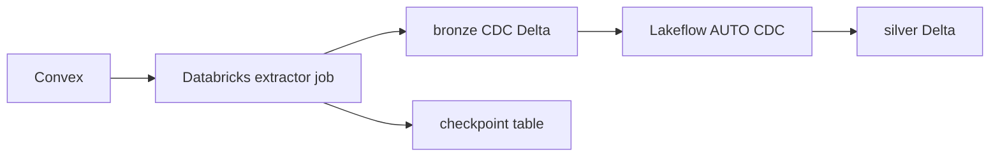
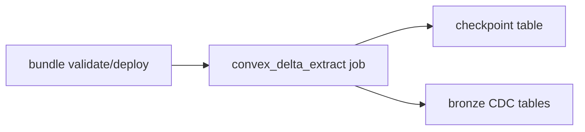

# Databricks Delta Target

Databricks as the primary landing plane:

- the extractor job pulls Convex snapshot and delta pages
- bronze Delta tables store append-only CDC rows
- a control table stores checkpoints
- Lakeflow `AUTO CDC` turns bronze CDC into silver current-state tables



CDC metadata columns are reserved with a `_cdc_` prefix so user document fields
cannot overwrite key, ordering, or delete semantics.

## Layout

- `databricks.yml`: Databricks bundle entrypoint
- `resources/`: Databricks bundle resources for the extractor job
- `dashboards/`: Lakeview dashboard templates and metadata
- `extractor/convex_cdc_job.py`: Databricks job entrypoint
- `sql/bootstrap/`: ordered bootstrap DDL for configurable control/bronze/silver schemas and checkpoint table
- `lakeflow/bronze_to_silver_template.sql`: per-table Lakeflow template

## Deploy Surface

Bundle lifecycle:

- `scripts/ensure-databricks-delta-secret.sh <profile> [scope] [key]`
- `scripts/bootstrap-databricks-delta.sh <profile> <warehouse_id>`
- `scripts/render-databricks-delta-dashboard.sh <output_file>`
- `scripts/publish-databricks-delta-dashboard.sh <profile> <warehouse_id> [dashboard_id]`
- `scripts/deploy-databricks-delta.sh <profile> <target>`
- `scripts/run-databricks-delta-job.sh <profile> <target> [job_key]`
- `scripts/run-databricks-delta-smoke.sh <profile> <target> <warehouse_id>`

These scripts default `DATABRICKS_BUNDLE_ENGINE=direct` so deployment does not
depend on Terraform downloads.

## Secret Contract

The Databricks bundle never receives the raw Convex deploy key as a bundle
variable.

- The deploy key lives in a Databricks secret scope.
- The bundle only carries the secret scope name and secret key name.
- The extractor resolves the deploy key inside Databricks at runtime with
  `dbutils.secrets.get(...)`.

Helper defaults:

- `DATABRICKS_DELTA_SECRET_SCOPE=convex-sync-kit-meshix-api`
- `DATABRICKS_DELTA_SECRET_KEY=convex-deploy-key`

Source-aware defaults come from `sources/<slug>/env.sh`. The current checked-in
profile is `sources/meshix-api/env.sh`.

Recommended long-lived naming:

- `convex_sync_kit_<source>_delta_control`
- `convex_sync_kit_<source>_delta_bronze`
- `convex_sync_kit_<source>_delta_silver`

The Databricks bundle also uses a source-specific deployment slug so multiple
Convex sources can coexist in one workspace without clobbering each other's
bundle state or extractor job names.

If `CONVEX_DEPLOY_KEY` is available locally, the deploy and run helpers will
create or update that Databricks secret automatically before validating,
deploying, or running the job. If the local key is not available, the helpers
require the target Databricks secret to already exist.

Bootstrap SQL can still be applied directly with:

- `scripts/apply-databricks-sql-dir.sh <profile> <warehouse_id> <rendered_sql_dir>`
- `scripts/bootstrap-databricks-delta.sh <profile> <warehouse_id>`

The extractor mirrors the Rust source/checkpoint logic and does not depend on
the local parquet/S3 path.

## Typical Flow



Recommended operator entrypoints:

```bash
just databricks-delta-sync-secret
just databricks-delta-bootstrap <warehouse_id>
just databricks-delta-publish-dashboard DEFAULT <warehouse_id>
just databricks-delta-deploy
just databricks-delta-run
just databricks-delta-smoke <warehouse_id>
```
