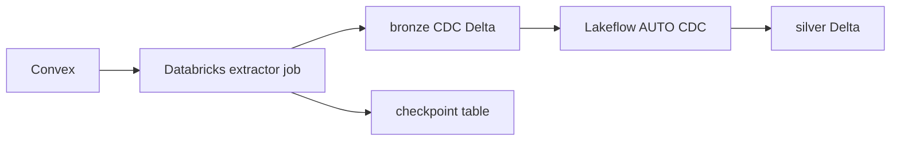

# Databricks-native Target

Databricks as the primary landing plane:

- the extractor job pulls Convex snapshot and delta pages
- bronze Delta tables store append-only CDC rows
- a control table stores checkpoints
- Lakeflow `AUTO CDC` turns bronze CDC into silver current-state tables

CDC metadata columns are reserved with a `_cdc_` prefix so user document fields
cannot overwrite key, ordering, or delete semantics.

## Layout

- `extractor/convex_cdc_job.py`: Databricks job entrypoint
- `sql/bootstrap/`: ordered bootstrap DDL for configurable control/bronze/silver schemas and checkpoint table
- `lakeflow/bronze_to_silver_template.sql`: per-table Lakeflow template

Apply the bootstrap directory with:

- `scripts/apply-databricks-sql-dir.sh <profile> <warehouse_id> <rendered_sql_dir>`

The extractor mirrors the Rust source/checkpoint logic and does not depend on
the local parquet/S3 path.
