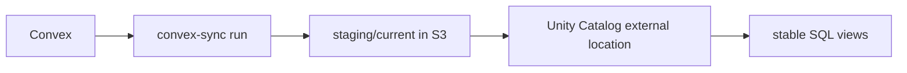

# Databricks over S3 Exports

This variation keeps the Rust exporter and S3 publish path as the source of
truth, then lets Databricks consume the published parquet snapshots.



## Contents

- `terraform/unity_catalog_s3_external_location/`: storage credential, external location, grants
- `sql/register_staging_views.sql.tmpl`: stable `read_files(...)` view template

## Operational Rule

The published `staging/current` prefix must be covered by a Unity Catalog
external location before the view sync is applied.

Recommended entrypoint:

```bash
just databricks-sync-staging-views --warehouse-id <warehouse-id> --bucket <bucket> --prefix <prefix>
```
